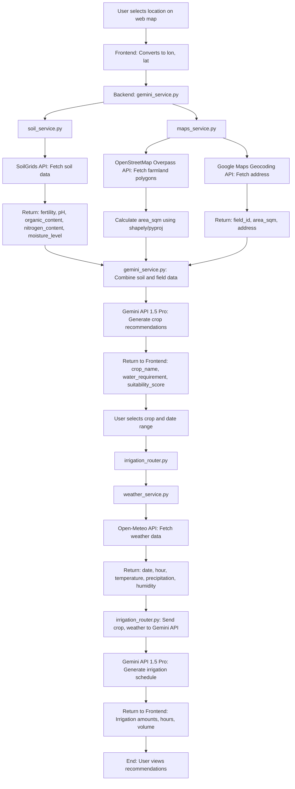

# Sustainable Agriculture Platform

A web application to combat water recession in Turkey by optimizing crop selection and irrigation using AI and geospatial APIs. The platform reduces agricultural water waste (responsible for ~70% of Turkey’s water recession), lowers CO2 emissions, and boosts crop yields, contributing to economic growth.

## Features
- **Crop Recommendations**: Suggests optimal crops based on soil data (SoilGrids API) and field location, powered by Gemini 1.5 Pro.
- **Field Area Calculation**: Determines farm area using OpenStreetMap (Overpass API) and Google Maps Geocoding API.
- **Irrigation Optimization**: Provides precise irrigation schedules using weather forecasts (Open-Meteo API) and AI analysis (Gemini 1.5 Pro).
- **Sustainability**: Decreases water and energy use, addressing environmental and economic challenges in Turkish agriculture.

## Project Structure
```
Sustainability/
├── .env                    # Environment variables (API keys)
├── requirements.txt        # Python dependencies
└── app/
    ├── config.py           # Loads .env using pydantic-settings
    ├── __init__.py         # Marks app/ as a Python package
    ├── main.py             # FastAPI application entry point
    ├── models.py           # Data models (e.g., Pydantic schemas)
    ├── routers/            # API endpoints
    │   ├── field_router.py     # Handles field-related requests
    │   ├── __init__.py         # Marks routers/ as a package
    │   ├── irrigation_router.py # Handles irrigation schedule requests
    └── services/           # API integrations and logic
        ├── gemini_service.py   # Orchestrates soil, field, and crop recommendation logic
        ├── maps_service.py     # Calculates field area (OpenStreetMap, Google Maps)
        ├── soil_service.py     # Fetches soil data (SoilGrids API)
        ├── weather_service.py  # Fetches weather forecasts (Open-Meteo API)
        ├── test_maps_service.py # Tests maps_service.py
        ├── test_soil_service.py # Tests soil_service.py
        ├── __init__.py         # Marks services/ as a package
        └── __pycache__/        # Compiled Python files
```

## Technologies
- **Backend**: Python, FastAPI
- **APIs**:
  - SoilGrids (soil data)
  - OpenStreetMap Overpass API (farmland polygons)
  - Google Maps Geocoding API (address formatting)
  - Open-Meteo API (weather forecasts)
  - Gemini 1.5 Pro (crop recommendations, irrigation optimization)
- **Libraries**: `aiohttp`, `shapely`, `pyproj`,`fastapi`,`pydantic`,`python-dotenv`,`googlegenerativeai`
- **Database**: SQLite (default, configurable via `config.py`)

## Setup
1. **Clone the Repository**:
   ```bash
   git clone https://github.com/username/Sustainability
   cd Sustainability
   ```
2. **Create a Virtual Environment**:
   ```bash
   python3 -m venv venv
   source venv/bin/activate
   ```
3. **Install Dependencies**:
   ```bash
   pip install -r requirements.txt
   ```
4. **Configure Environment Variables**:
   - Create a `.env` file in the root directory:
     ```bash
     touch .env
     ```
   - Add the following (replace with your API keys):
     ```
     GOOGLE_MAPS_API_KEY=your_google_maps_key
     GEMINI_API_KEY=your_gemini_key
     DATABASE_URL=sqlite:///./agriculture.db
     ```
   - Note: Open-Meteo and SoilGrids APIs are keyless. `OPENWEATHER_API_KEY` may be unused if `weather_service.py` uses Open-Meteo.
5. **Run the Application**:
   ```bash
   python3 app/main.py
   ```
   - Access the API at `http://localhost:8000` (default FastAPI port).

## Usage
1. **Select a Location**:
   - Use the web interface to pick a farm location on a map, which converts to longitude and latitude (`lon`, `lat`).
2. **Get Crop Recommendations**:
   - The app fetches soil data (`soil_service.py`) and field area (`maps_service.py`).
   - `gemini_service.py` uses Gemini 1.5 Pro to recommend crops:
     - `crop_name`
     - `water_requirement_liters_per_sqm`
     - `suitability_score`
3. **Plan Irrigation**:
   - Choose a crop and date range via `irrigation_router.py`.
   - `weather_service.py` provides weather data (temperature, precipitation, humidity).
   - Gemini 1.5 Pro generates an optimal irrigation schedule (hours, water amounts).

## Workflow
The following Mermaid diagram illustrates the system’s data flow and API interactions:



## API Integrations
- **SoilGrids**: Provides soil properties (fertility, pH, etc.) for crop suitability.
- **OpenStreetMap (Overpass API)**: Fetches farmland polygons to calculate field area; falls back to 100m radius estimation.
- **Google Maps Geocoding**: Converts `lon`, `lat` to a human-readable address.
- **Open-Meteo**: Delivers weather forecasts (temperature, precipitation, humidity) for 3 hours daily.
- **Gemini 1.5 Pro**: Analyzes soil, field, and weather data to recommend crops and optimize irrigation.

## Contributing
1. Fork the repository.
2. Create a feature branch: `git checkout -b feature-name`.
3. Commit changes: `git commit -m "Add feature"`.
4. Push to the branch: `git push origin feature-name`.
5. Open a pull request.

## License
[MIT License](LICENSE) (or specify your license).

## Contact
- **Maintainer**: Ibrahim
- **Email**: mammadli0088@outlook.com

## Acknowledgments
- Built with inspiration to address Turkey’s water recession crisis.
- Thanks to open-source APIs (SoilGrids, OpenStreetMap, Open-Meteo) and Gemini AI.
